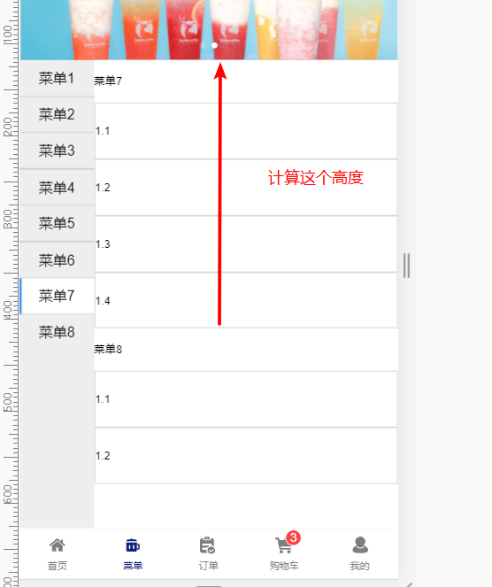

# vant-app

## Project setup
```
npm install
```

### Compiles and hot-reloads for development
```
npm run serve
```

## 模块

###  cart

价格保留两位小数 

```js
formatPrice(price) {
      return (price / 100).toFixed(2)
    },
        
提交文字的按钮 , 这里还有checked的数量
submitBarText() {
      const count = this.checkedResult.length
      return '结算' + (count ? `(${count})` : '')
    },
```


# 其他的东西


Math.abs(Math.round(pos.y)) ,`round`把不同的数舍入为最接近的整数


[Vue-给对象新增属性（使用Vue.$set()）](https://www.jianshu.com/p/71b1807b1815)

Vue 不允许在已经创建的实例上动态添加新的根级响应式属性 (root-level reactive property)。然而它可以使用 Vue.set(object, key, value) 方法将响应属性添加到嵌套的对象上

Vue.set(vm.obj, 'e', 0) / his.$set(this.obj,'e',02)


// 代替 `Object.assign(this.obj, { a: 1, e: 2 })`

this.obj= Object.assign({}, this.obj, { a: 1, e: 2 })

# 知道但是没解决的问题

home组件的首页轮播图,点击没有跳到指定的图片

**最后一个菜单由于高度不够,导致active不能设置**

上图



应该可以计算上面菜单的高度,然后设置刚好的该高度

,滚动了,怎么算...暂时

还有滑动过渡,再滑动回来会导致位置乱了,要重新从菜单0出发才正常,后面再想解决办法.

> 预计解决: 滑动过渡可以把scrollY 设置成计算属性,超过最大值返回 ....不行
>
> 暂时先给最后一个li设置一个margin解决


# 遇到的问题

## 路由导入Home组件报错

> 文件夹改成homes,或者路由配置@/views/home/index


## 在 layout 组件引入 app-main(包含home组件) 和 tarbar组件,由于swipe原因,点击tarbar时,页面内容会抖动

解决办法: 首先给swipe组件加一个外层容器 `.swipe-box` 然后增加 css 代码

```css
  &-swipe-wrapper {
    transform: translateZ(0);
    overflow: hidden;
  }
  /* 两个缺一补个 , 原因 ??? */
```

[轮播图轮播时的抖动解决方案](https://blog.csdn.net/weixin_44442095/article/details/87614913)

[移动端轮播图下内容抖动问题](https://blog.csdn.net/weixin_44442095/article/details/87614913)


## [Chrome浏览器不支持字体小于12px的解决办法](https://blog.csdn.net/xjun0812/article/details/50497137)

第一种:

```css
span {
  font-size: 12px;
  transform: scale(0.8);
  display: block; /* transform:scale()这个属性只为可以缩放可以定义宽高的元素*/
}

/* 另外如果只是调整 p 元素(p里面没有span), 可以设置 -webkit-transform-origin-x: 0; ,可以防止两边空白 */

width: 300px;
-webkit-transform-origin-x: 0;   //X方向上缩放的中心点
-webkit-transform: scale(0.9);   //缩放比例
transform: scale(0.9);
 
在使用的时候，需要注意的是这种方法需要提前计算好文字的宽度，然后按照比例进行缩放。
这里只写了chrome浏览器的兼容性，要兼容其他的浏览器把前缀加上即可。

<style> 
    //方法一 
    .setSize{ 
        font-size: 10px; 
        transform: scale(0.7); 
        display: inline-block; 
    } 
 
    //方法二 
    .setSize{ 
        font-size: 22px; 
        transform: scale(0.5); 
        transform-origin: 0% 0%; 
    } 
</style>
```

第二种:(可能失效)

```css
   html,body{ -webkit-text-size-adjust:none; }
```

[解决浏览器或移动端不支持小于12px的字体](https://blog.csdn.net/Raytheon107/article/details/82733865)


## Vue组件 Tabbar 切换过渡抖动

原因是因为使用了fixed 跟 transform?

解决办法:

[vuejs 过渡动画 头部抖动问题](https://segmentfault.com/q/1010000010884379)

[vue 过渡动画抖动问题处理](https://blog.csdn.net/qq_25610161/article/details/81940863)

或者不同位移的动画,只用fade动画

```html
<router-view :key="key" class="page" /> // 1.现在router-view设置一个类
//2.然后设置样式
.page {
  position: absolute;
  top: 0;
  bottom: 0;
  width: 100%;
  margin: 0 auto;
  overflow-y: auto;
  overflow-x: hidden;
  -webkit-overflow-scrolling: touch;
}
//3.设置过渡动画
.v-enter {
  opacity: 0;
  transform: translateX(100%);
}

.v-leave-to {
  opacity: 0;
  transform: translateX(-100%);
  // position: absolute;
}

.v-enter-active,
.v-leave-active {
  transition: transform 0.38s ease;
}

// 或者设置样式代码直接在.v-*-active里面设置

```

## [better-scroll无法滚动](https://blog.csdn.net/qiqi_77_/article/details/79361413#commentBox)

### 由这问题,可以引出vh的用法

可以结合calc用

```css
身高：100vh =视口高度的100％ 


身高：100 ％ =父元素高度的100％

1、min-height: calc(100vh - 0rem);

2、width: calc(100% - 0.4rem);

3、width: calc(100vw - 0.4rem);
```

[视区相关单位vw, vh..简介以及可实际应用场景](https://www.zhangxinxu.com/wordpress/2012/09/new-viewport-relative-units-vw-vh-vm-vmin/)


## vue中keep-alive组件的使用

[vue中keep-alive组件的使用](http://www.fly63.com/article/detial/3923)

[vue开启keep-alive需要注意的问题](https://www.jianshu.com/p/be24d09f10bf)

[Vue / keep-alive](https://www.jianshu.com/p/4b55d312d297)

[Vue.js 中的动态路由](https://blog.csdn.net/zjq_1314520/article/details/79523109)

## 一件很傻的事

```js
    _initScroll() {
      this.menuScroll = new BScroll(this.$refs.menuWrapper, {
        click: true
      })
// 之前一直没这样用,this.menuScroll, 直接点一个属性出来给Vue
```


## Temp

```js
goods: [
        {
          id: '1',
          title: '进口香蕉',
          desc: '约250g，2根',
          price: 200,
          num: 1,
          thumb: 'https://img.yzcdn.cn/public_files/2017/10/24/2f9a36046449dafb8608e99990b3c205.jpeg'
        },
        {
          id: '2',
          title: '陕西蜜梨',
          desc: '约600g',
          price: 690,
          num: 1,
          thumb: 'https://img.yzcdn.cn/public_files/2017/10/24/f6aabd6ac5521195e01e8e89ee9fc63f.jpeg'
        },
        {
          id: '3',
          title: '美国伽力果',
          desc: '约680g/3个',
          price: 2680,
          num: 1,
          thumb: 'https://img.yzcdn.cn/public_files/2017/10/24/320454216bbe9e25c7651e1fa51b31fd.jpeg'
        }
      ]
```
